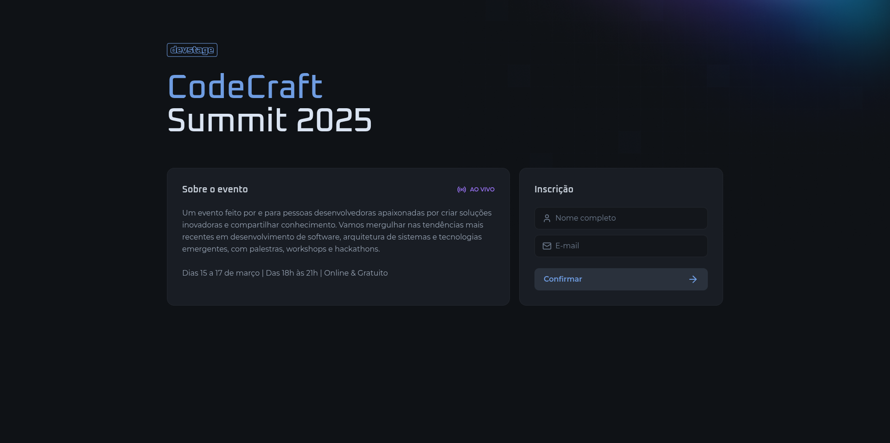
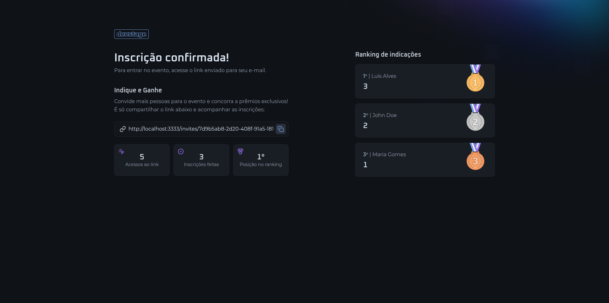

# devstage




This project is a web app to subscribe for an event and refer people through a referral link.

The Figma layout can be accessed [here](https://www.figma.com/community/file/1471119935944492720).

> The app was built during a programming event created by Rocketseat.

## Running

This app is integrated with an API, so you must clone the repository and follow the steps below to start the server.

### Server

```sh
# Clone this repository
git clone https://github.com/rocketseat-education/nlw-connect-node.git

# Install the dependencies
npm i

# Run docker
docker compose up -d

# Run migrations
npm run db:migrate

# Start server
npm run dev
```

### Web

```sh
# Clone this repository
git clone https://github.com/luismda/devstage-web.git

# Install the dependencies
npm i

# Start app
npm run dev
```